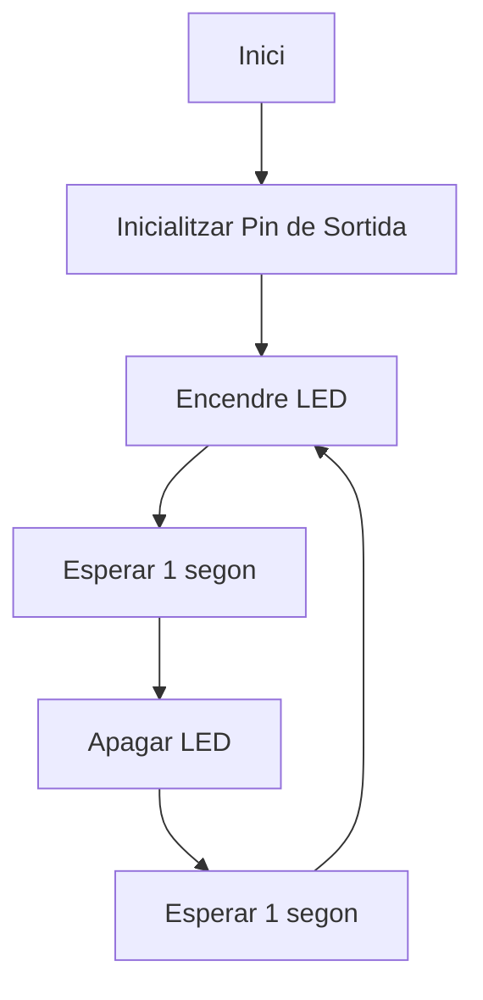
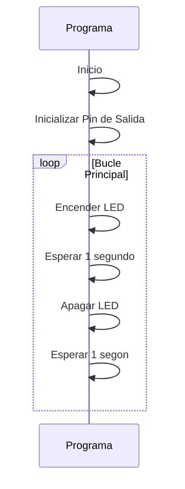

# PRACTICA 1  :  BLINK
Alumnes: **Bernat Rubiol i Àfrica Abad**

## Objectiu
El objeticvo de la practica es producir el parpadeo periodico de un led. 
Se utilizara la salida serie  para depurar  el programa 

El microcontrolador que utilizaremos es el ya comentado en la introducción  **ESP32**

## TASQUES I PREGUNTES 

1. Generar el programa  y subir el codigo  al github de cada uno

2. Modificar el programa para que incluya el envio de datos (ON y OFF) al puerto serie.
    Añadir la iunicialización del puerto serie y el envio cada vez que cambia el estado del led
   - Iniciar pin de led como salida 
   - Iniciar el terminal serie                      
   - bucle infinito  
       * encender led  
       * sacar por puerto serie mensaje *ON*          
       * espera de 1000 milisegundos  
       * apagar led  
       * sacar por puesto serie mensaje *OFF*        
       * espera de 1000 milisegundos  
   ```cpp
   #include <Arduino.h>

   int led = 13; 

   void setup() {                
      pinMode(led, OUTPUT);   
      Serial.begin(115200);
   }

   void loop() {
      Serial.println("ON");
      digitalWrite(led, HIGH);
      delay(1000);
      Serial.println("OFF");      
      digitalWrite(led, LOW);
      delay(1000);
   }
   ```

3. Modificar el programa para que actue directamente sobre los registros de los puertos de entrada y salida
   ```cpp
   #include <Arduino.h>

   int led = 13;

   void setup() {                
      pinMode(led, OUTPUT);   
      Serial.begin(115200);
   }

   void loop() {
      Serial.println("ON");
      digitalWrite(led, HIGH);
      Serial.println("OFF");      
      digitalWrite(led, LOW);
   }
   ```
4. Eliminar los delay modificar el pin de salida a uno cualquiera de los que estan disponibles i medir con el osciloscopio cual es la màxima frecuencia de apagado encendido que permite el microcontrolador. Medir la frecuencia en estos cuatro casos: 
   - 4.1 Con el envio por el puerto série del mensaje i utilizando las funciones de Arduino
   ```cpp
   #include <Arduino.h>

   int led = 13; 

   void setup() {                
      pinMode(led, OUTPUT);   
      Serial.begin(115200);
   }

   void loop() {
      Serial.println("ON");
      digitalWrite(led, HIGH);
      Serial.println("OFF");      
      digitalWrite(led, LOW);
   }
   ```
En aquest cas es de **34.2us o 29,24KHZ**
   - 4.2 Con el envio por el puerto série y accedirendo directamente a los registros:
   ```cpp
   #include <Arduino.h>

   int led = 13;
   uint32_t *gpio_out = (uint32_t *)GPIO_OUT_REG;

   void setup() {                
      pinMode(led, OUTPUT);   
      Serial.begin(115200);
   }

   void loop() {
      Serial.println("ON");
      *gpio_out |= (1 << led);
      Serial.println("OFF");      
      *gpio_out ^= (1 << led);
   }
   ```
En Aquest cas es de **34.2us o 29.24KHZ**
   - 4.3 Sin el envio por el puerto série del mensaje i utilizando las funciones de Arduino
```cpp
#include <Arduino.h>
int led = 13; 

void setup() {                
   pinMode(led, OUTPUT);   
}

void loop() {
   digitalWrite(led, HIGH);
   digitalWrite(led, LOW);
}
   ```
En Aquest cas es de **568ns o 1.76MHZ**
   - 4.4 Sin el envio por el puerto série y accedirendo directamente a los registros
```cpp
#include <Arduino.h>

int led = 13; 
uint32_t *gpio_out = (uint32_t *)GPIO_OUT_REG;

void setup() {                
   pinMode(led, OUTPUT);   
}

void loop() {
   *gpio_out |= (1 << led);
   *gpio_out ^= (1 << led);
}
```
En aquest cas es de **212ns o 4.717MHZ**

5. Generar un informe fichero  informe.MD ( markdown ) donde se muestre el codigo, un diagrama de flujo y un diagrama de tiempos 

### Diagrama de flux



### Diagrama de temps




6. Responder a la siguiente pregunta en el programa que se ha realizado cual es el tiempo libre que tiene el procesador ?

El temps lliure del processador es el temps en que el processador no està fent res perque per exemple hi hem posat un delay, en el primer programa que hem fet era de 1000ms (1s)

# Conclusions

En aquesta primera pràctica hem vist com funciona un arduino i ens hem familiaritzat amb ell

# EJERCICIOS voluntarios  DE MEJORA DE NOTA

Elejir entre cualquiera de los siguentes:

* leer el valor de un convertidor  A/D  de entrada ; sacarlo por el puerto serie  y sacar el mismo valor  por otro pin  D/A

  - https://randomnerdtutorials.com/esp32-adc-analog-read-arduino-ide/

**Aquest es el codi complert amb l'apartat extra**
En aquest codi hem combinat els dos codis amb un menú per a poder triar que volem fer i els loops dels programes ja no son infinits sino que per a poder canviar de menu hem decidit limitar-los

```cpp
   #include <Arduino.h>
int pin_DAC=25;
int pin_ADC=34;
int LED=13;

void led(){
  for(int i=0;i<10;i++){
    digitalWrite(LED,HIGH);
    Serial.println("ON");
    delay(500);
    digitalWrite(LED,LOW);
    Serial.println("OFF");
    delay(500);
  }
}

void adc_dac(){
  int valor=0;
  for (int cont= 0; cont < 256; cont++){
    dacWrite(pin_DAC, cont);
    delay(50);
    valor = analogRead(pin_ADC);
    valor = map(valor, 0, 4096, 0, 255);
    Serial.println("VALOR:");
    Serial.println(valor);
    delay(100);
  }
}

void opcions(){
    Serial.println("Opcions");
    Serial.println("1. LED");
    Serial.println("2. ADC");
}

void menu(){
  char entrada;
  int b=0;
  if(b==0){
    opcions();
    entrada=Serial.read();
    }
  if(entrada=='1'){
    b=1;
    led();
    opcions();
    entrada=Serial.read();
  }
  else if(entrada=='2'){
    b=1;
    adc_dac();
    opcions();
    entrada=Serial.read();
  }
}

void setup() {
  Serial.begin(115200);
  pinMode(LED,OUTPUT);
  analogReadResolution(12);
}

void loop() {
  delay(100);
  if (Serial.available()){
    menu();
  }
}   
```